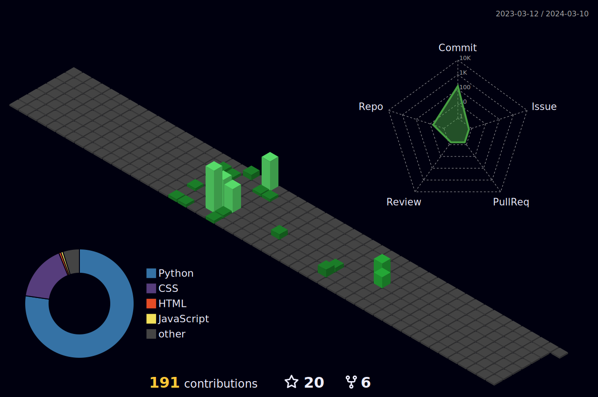

# Hey there! 👋

 

## My name is Izaan Qaiser.
#### I'm a 17 Year Old Student studying Engineering and Computer Science at MDHS!
#### *My dream is to be a Software Engineering Student at the University of Waterloo!*
## Some more about me:

- 🔥 I love learning about programming topics and applying them to my life
- 📫 Co-founder of a startup that provides SMMA services to businesses!
- 🔭 Actively looking for University Research Assistant Positions
- 📚 I'm currently learning Python from Dr. Angela Yu's "100 Days of Python Course"!

